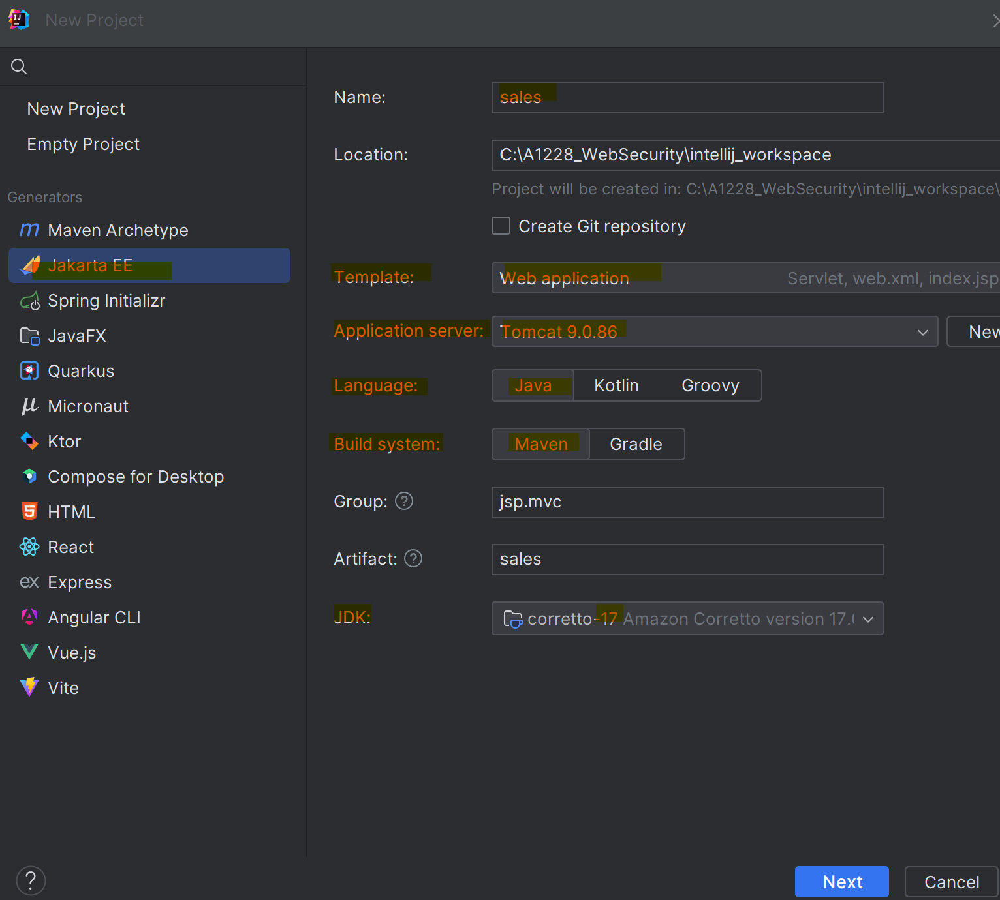
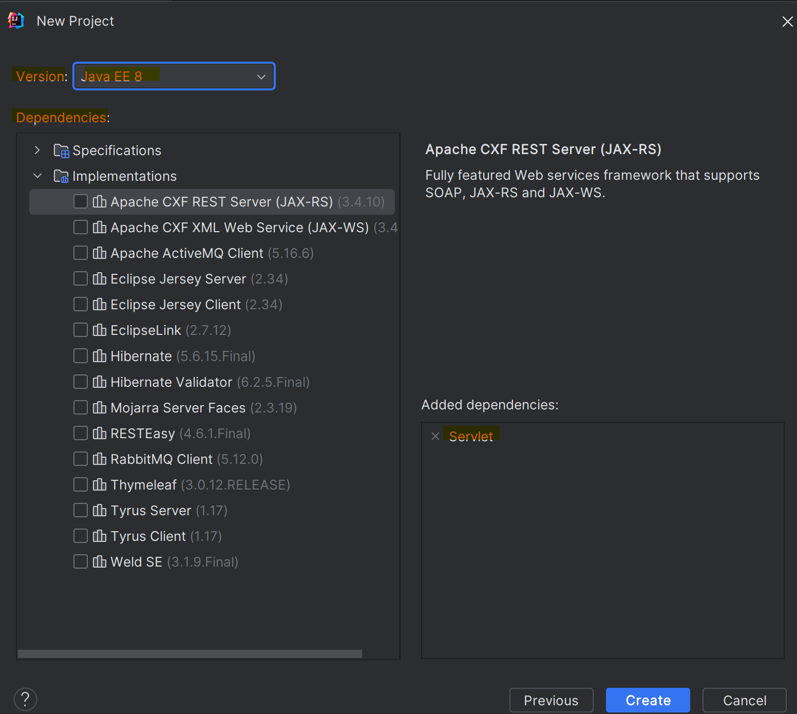
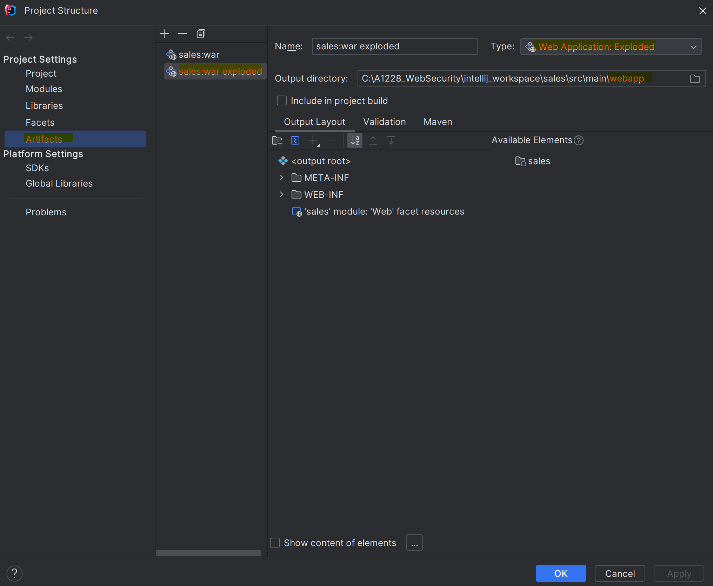
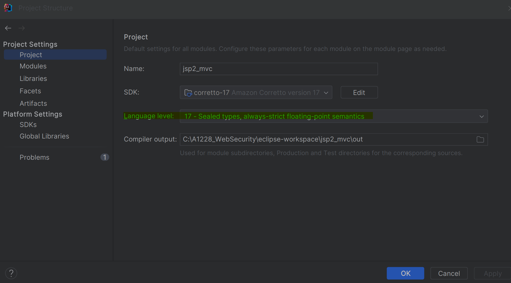

# `Servlet` Dynamic Web Project 환경 구축 `only JSP`  With `IntelliJ`


## 1. IntelliJ 환경 설정 JSP 프로젝트 생성 - Servlet4.0

**한글 깨짐 설정** 

1. **파일 인코딩 설정**
    
    `File - Settings` 메뉴로 이동 > `File Encoding` 메뉴를 선택 > 여기서 `Global Encoding, Project Encoding, Properties Files`를 모두 `UTF-8`로 변경

1. **서버 VM 옵션 설정**

    `Run/Debug Configurations (Edit Configuration)` > `Tomcat Server` > `[해당서버]의 VM options`에 `-Dfile.encoding=UTF-8` 추가

1. **IntelliJ 가상머신 인코딩 설정**
    
    `Help 메뉴 - Edit Custom VM Options` 선택 > `UTF-8 설정`을 추가합니다3.
    ```shell
    -Dfile.encoding=UTF-8
    -Dconsole.encoding=UTF-8
    ```

1. **설정이 끝나면 IntelliJ를 다시 시작해야함**


### JSP Servlet 프로젝트 생성  
1. 인텔리제이를 실행시킨 후 New - Project.. 를 해준다

1. Jakara EE - Template : Web Application - Maven - JDK 17을 선택해준다.  
    

1. Java 플랫폼의 버전은 Java EE를 선택하고 Servlet 의존성을 추가한다.
    

1. Artifacts를 누르고 Output directory 디렉토리를 webapp(자신의 web 소스가 있는 디렉토리)을 선택한다. 서버를 다시 실행시키면 이후부터는 jsp 파일 내용 수정 시 바로 반영이 된다.
    


    **참고**
    https://velog.io/@max9106/JSP-intelliJ%EB%A1%9C-JSP-%ED%94%84%EB%A1%9C%EC%A0%9D%ED%8A%B8-%EC%83%9D%EC%84%B1-jek572fhfx

## 참고
### 인텔리제이 단축키
1. `한줄 복사` : `ctrl+d`
1. `한줄 삭제` : `ctrl+y`
1. `파일이름으로 파일 찾기` : `shift + ctrl + n`
1. `확대` : `Alt + Shift + =`
1. `축소` : `Alt + Shift + -`

### 프로젝트 구조 - Language Level 설정 의미
> Project Structure 설정 메뉴에서는 기본 Java 버전 설정(`SDK`) 외에 `Language Level`을 설정할 수 있다.

 
- Language Level 버전은 SDK 버전과 다를 수 있는데, 예를 들어 자바 버전은 JDK 9를 사용하더라도, Language Level은 JDK 8을 사용하여 코딩 시, 사용자가 JDK 9 버전의 문법을 사용하지 않게 막는다.

- **중요한 것은 컴파일에 영향을 미친다는 점.** 

    Project bytecode version ( `File > Settings > Build, Execution, Deployment > Compiler > Java Compiler`)이 따로 지정되지 않으면, Language Level에 지정된 값을 사용하여 바이트 코드가 생성된다.

- 프로젝트뿐만 아니라, 모듈에서도 역시 Language Level을 지정할 수 있다.

    출처: https://hianna.tistory.com/790 [어제 오늘 내일:티스토리]


