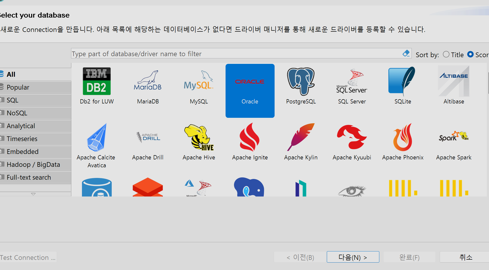
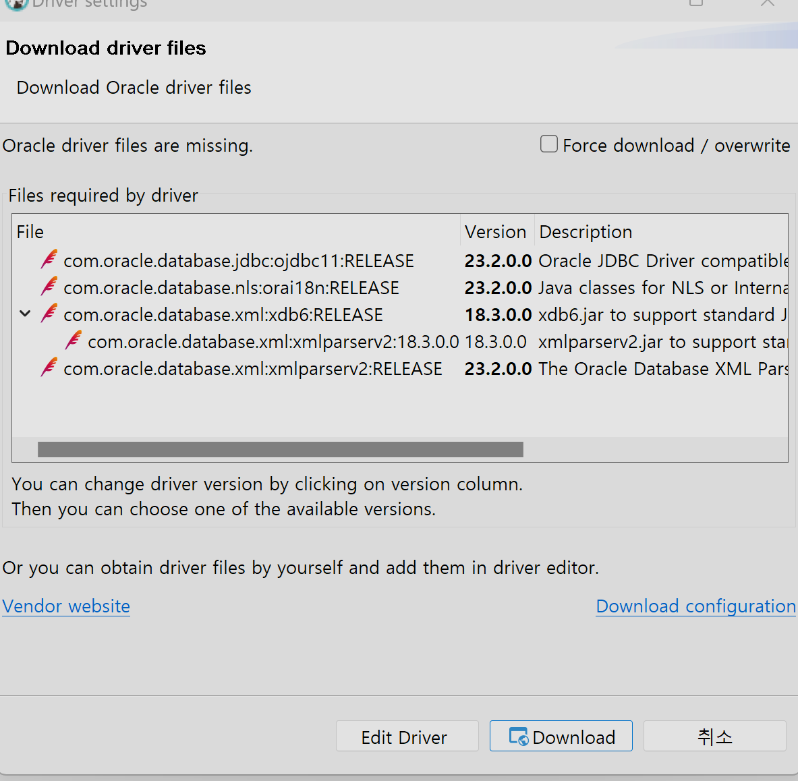
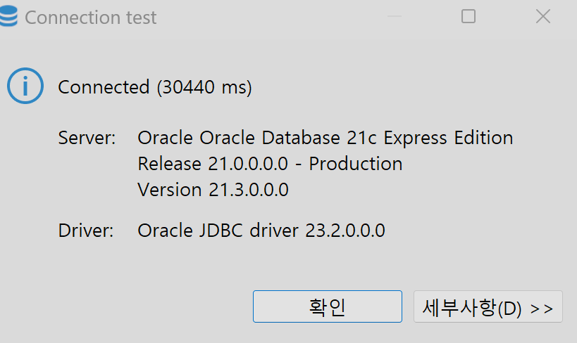

# Oracle21c 사용자 계정 테스트 witn cmd, DBeaver

## 1. 사용자 계정 접속 
- `connect c##idev/1234`

## 2. 현재 계정에 테이블 목록 확인
- `select * from tab;`
- tab : 테이블 목록을 보여주기 위한 가상테이블
- 테이블 이름과 그 테이블의 타입 확인 가능

## 3. 테이블 구조 확인
- `desc members;`

- 테이블의 컬럼 목록
    -  널 허용 여부 : null, not null
    -  유형 : number, varchar2 등

## DBeaver에서 오라클 서버 사용
### 설치
1. https://dbeaver.io/download/ 설치 
    - Windows (zip) 다운 후 압축해제

1. `dbeaver.exe` 실행

### 오라클 데이터베이스 서버 연결
1. 연결할 데이터베이스 선택 > Oracle 선택 > 다음

    

1. 오라클 접속 정보 입력
    1. 연결 유형
    - `host` (도메인이름, ip) : localhost
    - `port` (서버 포트) : 1521 
    -  `database`  : xe
    2. 사용자 계정 인증
    - `username` : c##idev
    - `password` : 1234
    3. Connection Detail 클릭

1. Test Connection 클릭
    1. 부족한 드라이버 다운로드 창 > 다운로드 클릭
        
        

1. 접속 성공
        
    