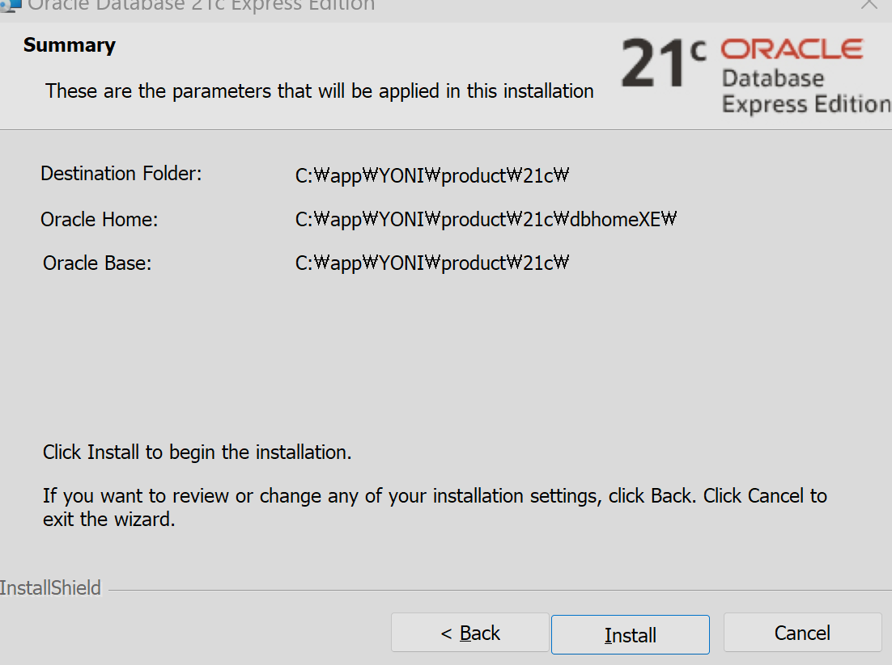
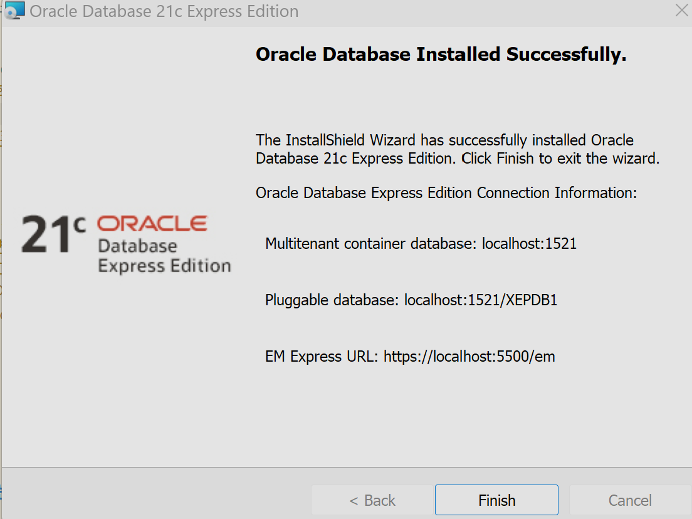
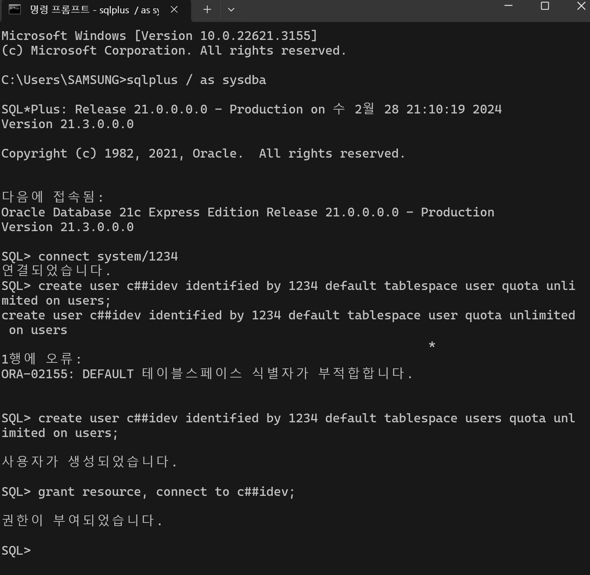
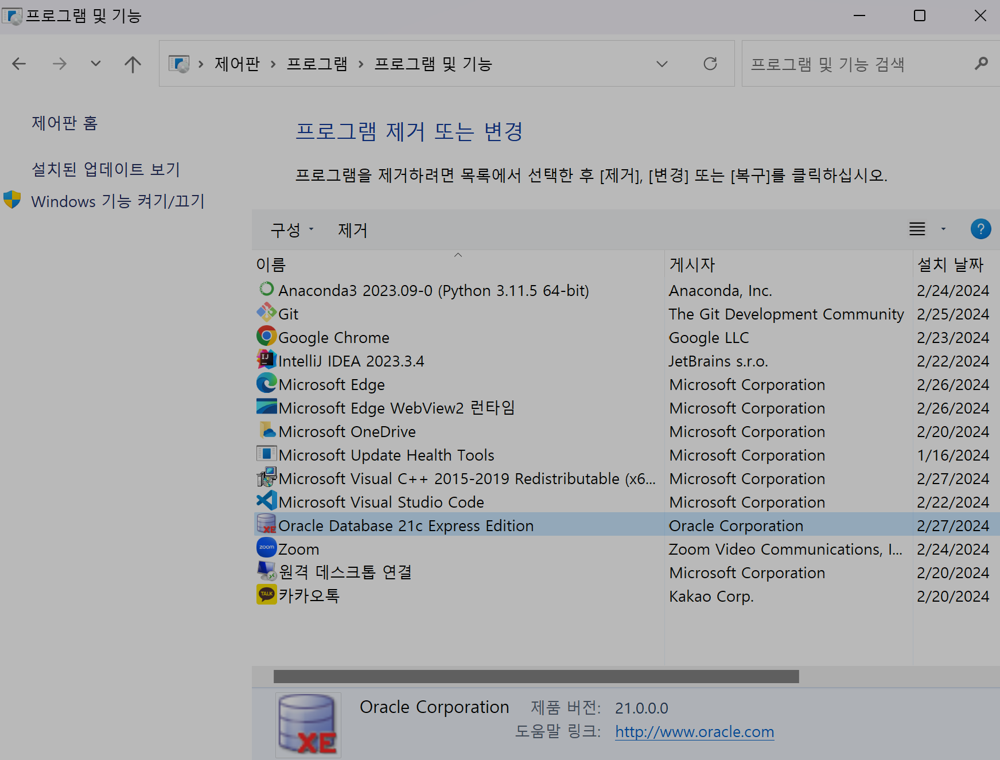
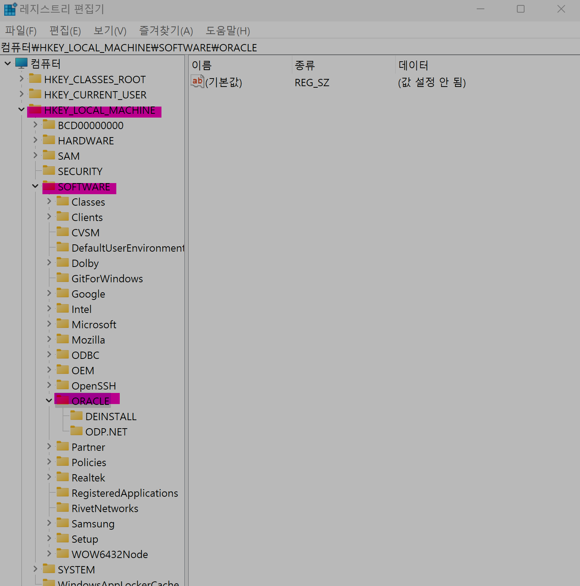

# Oracle 21c XE 설치 및 계정 생성 -Window11

## oracle 21c xe
- Oracle에서 제공하는 DBMS
- 작은 규모의 프로젝트나 Oracle DBMS 학습용으로 사용된다

## 1. 설치
1. 아래 주소로 들어가 
`C드라이브` 폴더에 다운받아 바로 압축해제
`Oracle Database 21c Express Edition for Windows x64` 다운
    https://www.oracle.com/kr/database/technologies/xe-downloads.html 

- 압축해제 후 `setup.exe` 실행
- system 관리자 비밀번호 : 1234
- Oracle Home 디렉토리 체크

    

2. 설치 성공

    
    

## 2. SQL Plus
- 오라클에서 기본으로 제공하는 도구
- 데이터베이스를 운영하면서 발생할 수 있는 문제에 대비한 프로그램
- 오라클을 설치할 때 같이 설치된다
- Command Line Interface 

## 3. 사용자 계정 생성
1. 명령 프롬프트 cmd 실행 

1. `sqlplus / as sysdba` 입력 
    - SQL PLUS 실행
    - 시스템 계정으로 로그인  

1. `connect system/1234`
    - 관리자 계정으로 로그인

1. `create user c##idev identified by 1234 default tablespace users quota unlimited on users;` 입력
    - 사용자 c##idev 계정 생성
    - 21c 에서는 계정이 사용할 저장 공간(tablespace) 설정이 필수

1. `grant resource, connect to c##idev`;
    - c##idev 계정에 연결, 리소스 사용 권한 부여
 
1. 계정 추가 성공

    

## 부록 : 완전히 삭제하는 방법

1. `제어판` : 프로그램 및 기능 >  Oracle 21c xe 선택 > 확인

    

1. `레지스트리` : 시작 > `Window + R` > `regedit` 입력 > HKEY-LOCAL_MACHIEN 클릭 > SOFTWARE 선택 >  ORACLE로 시작하는 여러개 삭제 `Delete`

    

1. `시스템 환경 변수` : 시작 > `Window + R` > `sysdm.cpl` 입력 > 시스템 속성-고급 > 환경변수 편집: PATH 잡힌 부분 삭제

1. `C:\Program Files` : Oracle 폴더 삭제

1. `재부팅`

