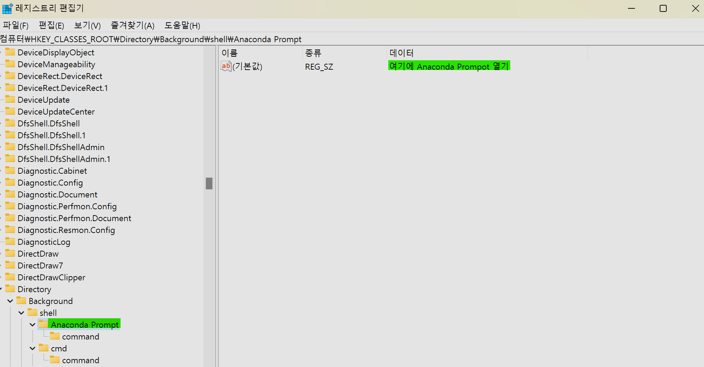
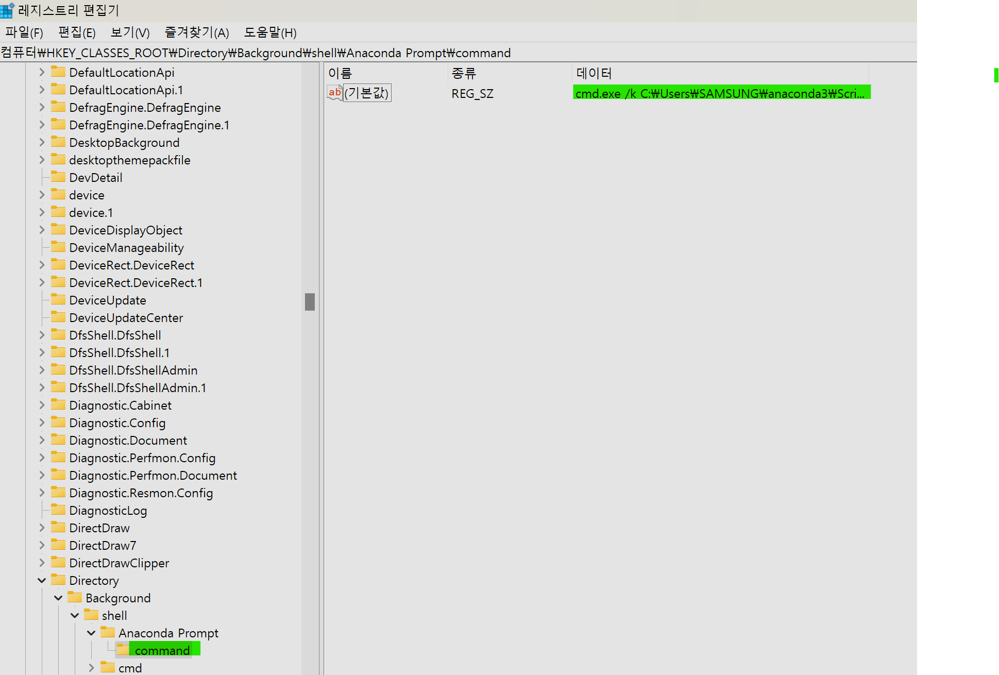

# Windows 우클릭 메뉴 `여기에 Anaconda Prompt 열기` 추가

1. `regedit.exe`를 실행한다.

2. `HKEY_CLASSES_ROOT > Directory > Background > shell`로 이동

3. Anaconda Prompt라는 키를 추가하고 그 값을 `여기에 Anaconda Prompt 열기`로 설정

- 이 값은 우클릭 메뉴에 표시되는 이름이다.

4. 이 키 아래 command 라는 키를 추가하고, 그 값을 `cmd.exe /k C:\Users\SAMSUNG\anaconda3\Scripts\activate.bat`로 설정

- 이 명령어 전체는 `Anaconda Prompt를 실행하고, 실행이 끝난 후에도 명령 프롬프트를 열린 상태로 유지하라`는 의미를 가진다.

- 실행 파일 경로는 Anaconda가 설치된 위치에 따라 변경해야 할 수도 있다.
