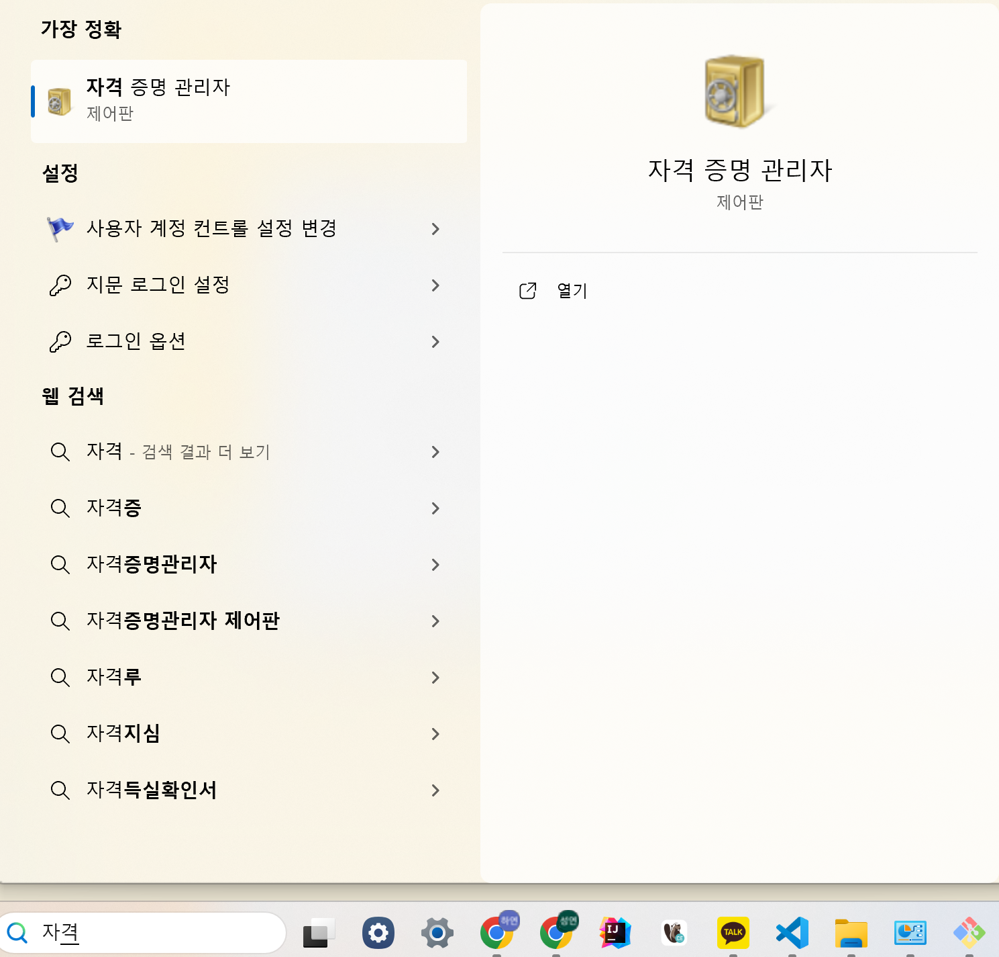
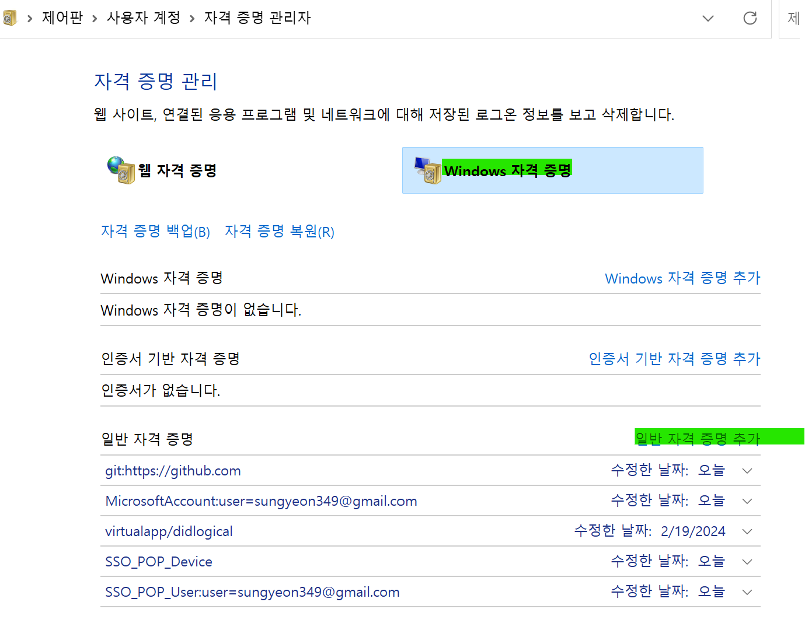
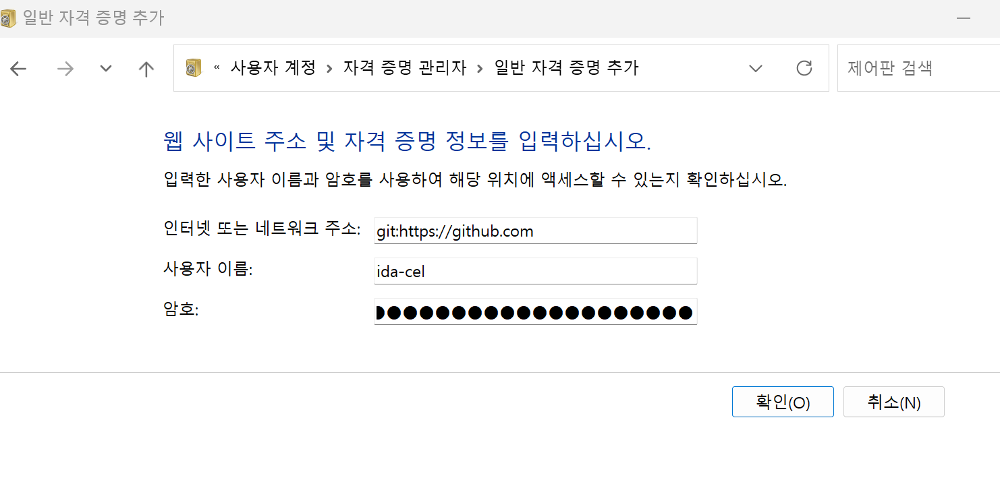

# Windows 자격 증명 관리자에 Github 토큰 추가하기

1. 시작메뉴에서 자격 증명 관리자를 엽니다.

    

1. Windows 자격 증명 탭을 클릭합니다.

1. 일반 자격 증명 추가를 클릭합니다.

    

1. 인터넷 또는 네트워크 주소 필드에 `git:https://github.com`을 입력합니다.
    
1. 사용자 이름 필드에 GitHub 사용자 이름을 입력합니다.

1. 비밀번호 필드에 GitHub에서 생성한 개인 액세스 토큰을 입력합니다.

1. 확인을 클릭하여 저장합니다.
---
이렇게 하면 Windows 자격 증명 관리자에 GitHub 토큰이 추가되고,
Git 명령을 실행할 때마다 이 토큰이 사용되어 GitHub에 인증됩니다.