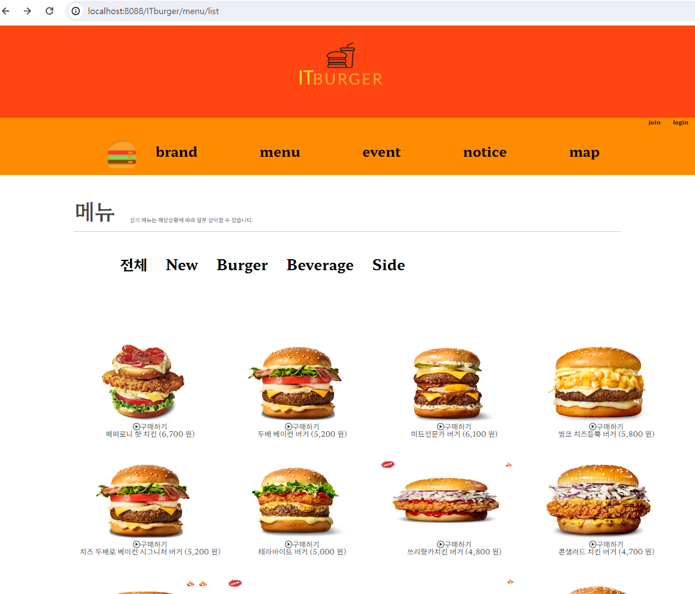
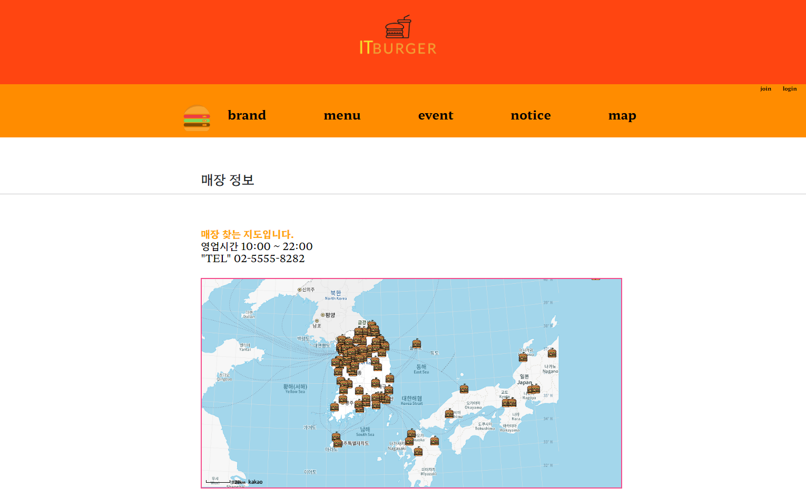
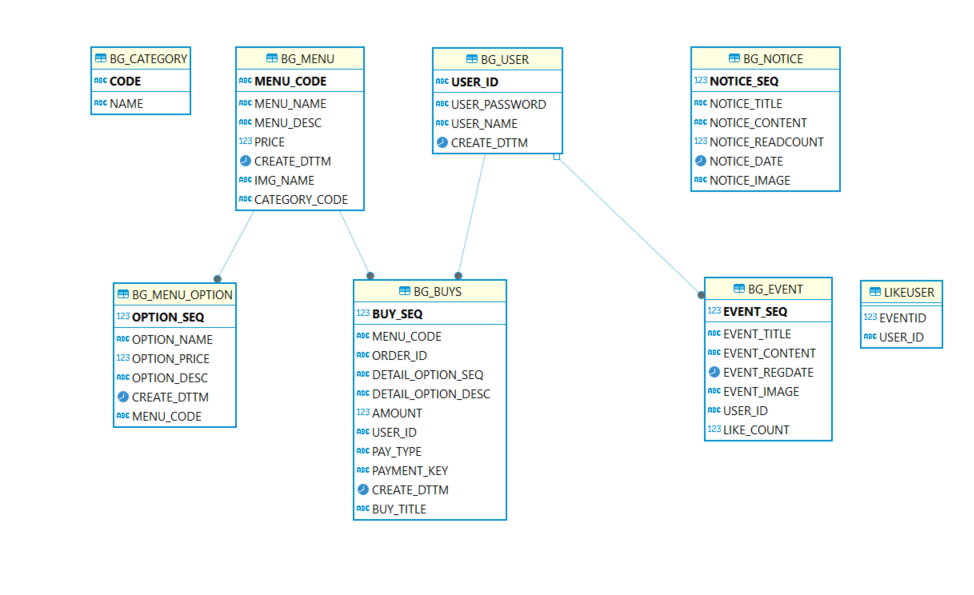
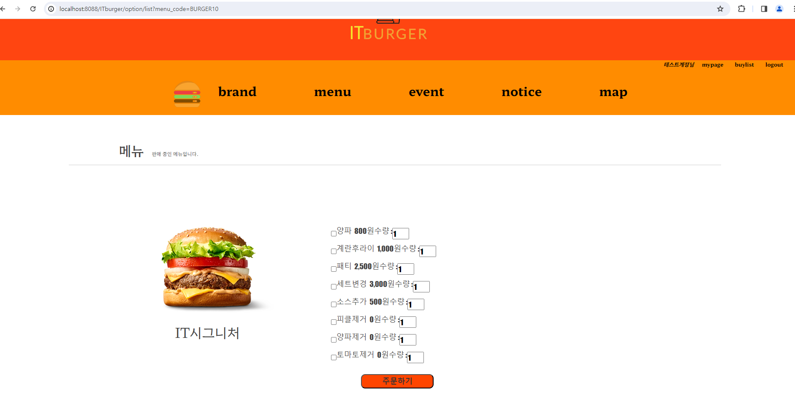
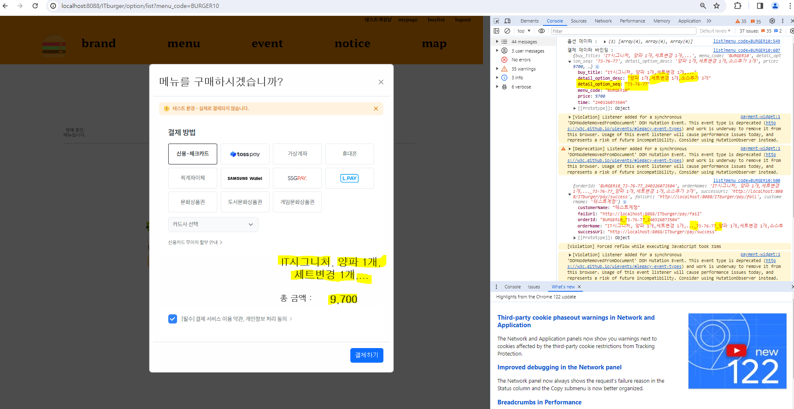
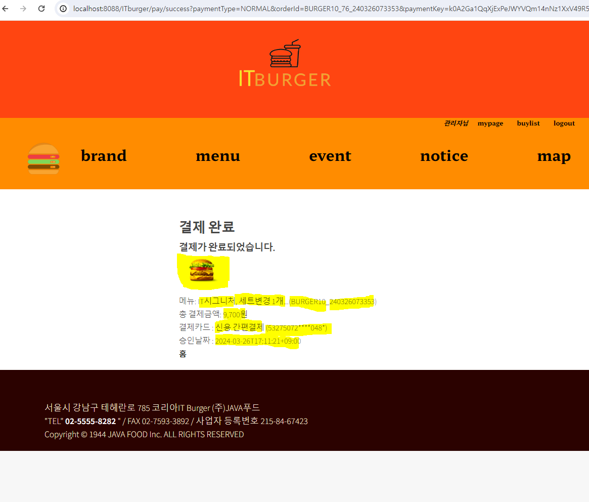
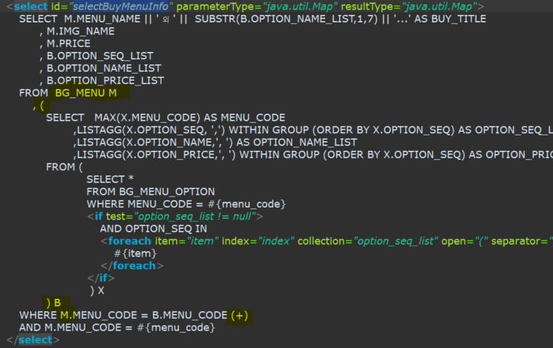
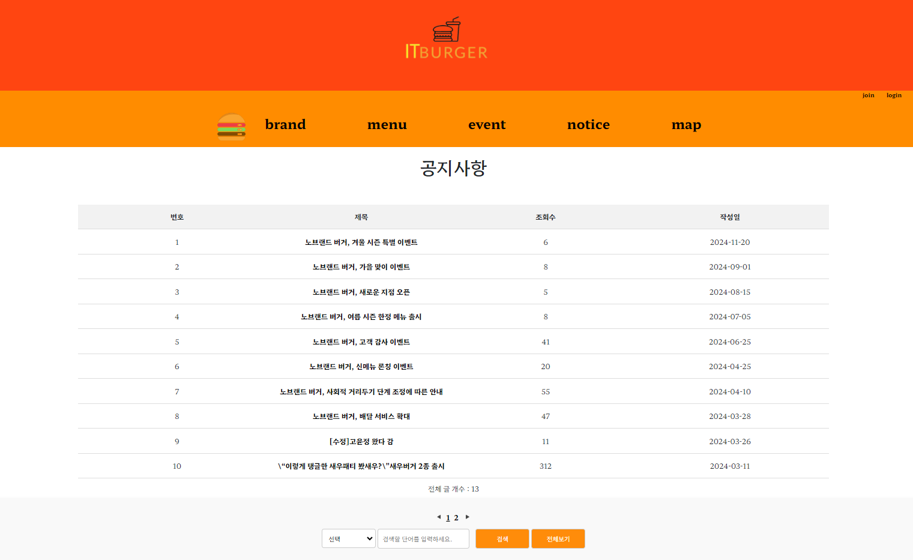
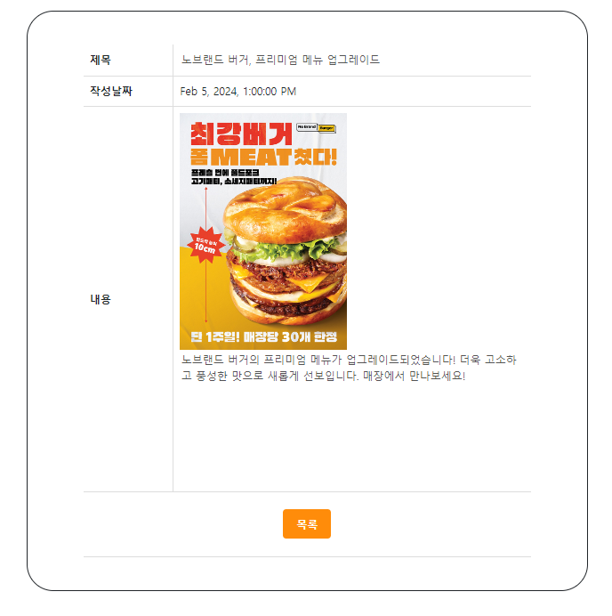

# [웹서버 구축 프로젝트] IT Burger - 햄버거 가게 사이트  

## 요약
수업시간에 배운 내용을 모두 적용하여 `Oracle 21c` 데이터베이스와 `Java17`을 사용한 햄버거 가게 웹사이트를 구축했습니다. `Servlet`과 `JSP`를 활용하여 서버 사이드 렌더링을 통해 빠르고 효율적으로 페이지를 로딩하고, `REST-API`를 비동기 방식으로 구현해 사용자 경험을 극대화하였습니다. `Mybatis`를 사용해 데이터베이스 연동을 간소화했습니다. `동적 검색 쿼리`를 통해 사용자가 원하는 IT burger의 데이터를 쉽고 빠르게 찾을 수 있도록 했습니다. 이 모든 것은 정보 보안 표준에 따라 `패스워드 해싱(암복호화)`을 포함하여 안전하게 보호됩니다.

이 사이트는 긍정적인 고객 경험을 제공하기 위해 `현장감 있는 데이터`를 사용하였습니다. 이 프로젝트는 사용자 경험적인 면에서 혁신적인 접근을 보여주고자 하는 `팀의 노력`과 `전문성`이 응축된 결과물입니다.

## 개요
`IT Burger 테이블 구조 정의`와 `프로젝트 진행 순서`를 `리드`했습니다. `150가지 햄버거`를 관리하고 `토스 결제 API 통해 간편하게 주문`할 수 있는 `핵심 기능`을 구현하고, `예외` 상황 발생, `비즈니스 규칙`이 적절히 반영된 `안정적인 시스템`을 구축하고 싶습니다. IT burger의 서비스를 향상시키고 고객에게 더 나은 경험을 제공하는 것이 이 모든 여정의 목표입니다.

## 일정

1. 주제 선정, 데이터 준비 : 3.19 ~ 3.20
1. 테이블 구조 정의  : 3.20
1. 역할 분담과 기능별 구현 : 3.20 ~ 3.25
1. 진행 상황 점검 및 QA 지원 : 3.25 ~ 3.26 
1. 완료 및 최종 발표 : 3.28

### IT Burger DB 테이블 정보

1. **IT burger 카테고리** :  `New` `Burger` `Side` `Beverage`

1. **IT burger 햄버거 메뉴** : `햄버거 `
    
    

1. **햄버거 옵션** : `햄버거 메뉴별로 등록된 선택 메뉴`

    

1. **주문 결제** : `결제 건별 정보`

    
    
    

    
1. **유저** : `관리자, 사용자`
1. **공지사항** 
    
    

    
1. **이벤트**
1. **이벤트 좋아요 유저** 

### 어려웠던 점

팀프로젝트에서 **DB 구조를 설계하는 중요한 역할**을 맡았습니다. 이 작업은 **정교하고 집중이 필요한** 작업이었는데, 제가 이를 진행하고 있었습니다. 그러나 약 40분 간 작업을 진행하던 중, **일부 팀원들로부터 시간적 압박을 받고**, 이로인해 집중력을 잃고 작업 효율이 떨어지는 상황이 발생하였습니다. 이 문제를 해결하기 위해, 저는 **팀원들과 소통을 시도하였습니다.** 제가 현재 맡은 작업의 중요성과 그에 따른 시간적 요구를 설명하였습니다. 또한, 팀원들에게 이 작업을 수행하는 동안 약간의 시간을 더 가질 수 있도록 요청하였습니다.
팀원들은 제 설명을 듣고 이해하였고, **작업을 완료할 수 있도록 필요한 시간을 가질 수 있게 배려했습니다**. 이로 인해, 저는 DB 구조 설계 작업을 성공적으로 완료할 수 있었습니다. 이 경험을 통해, `팀원들 간의 소통`의 `중요성`을 다시 한번 깨달았습니다.

### 아쉬운 점
- 회원 가입 정보를 받을 때 다음 우편번호 API를 넣거나 하는 등 효율적으로 신뢰가는 정보를 저장하고 싶습니다.

- 만약에 비밀번호를 잃어버렸을 경우 회원 이메일 정보를 사용해서 임시 비밀번호를 보내는 기능을 구현하고 싶습니다

- 무슨 메뉴를 고를지 챗봇에게 물어보고 오늘 무슨 메뉴를 주문하면 좋을지 대화하는 기능을 구현하고 싶습니다.

