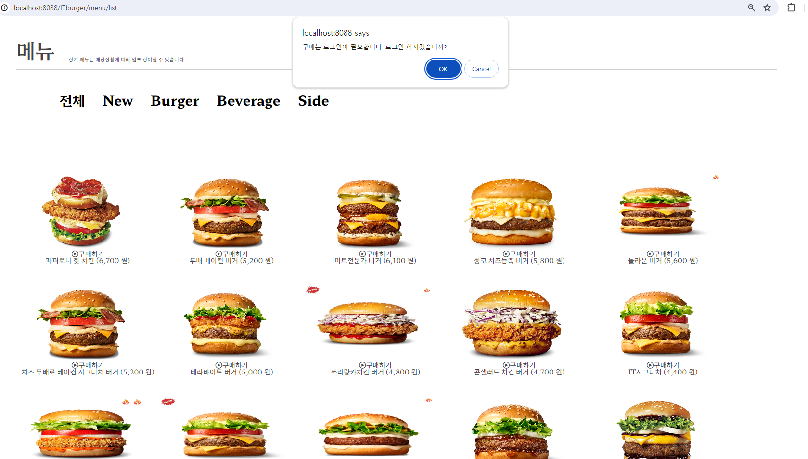

# [웹서버-구축-프로젝트] IT Burger  

## 요약
**`Oracle21c` `Servlet` `Java17` `REST-API-비동기` `JSP`  `Mybatis` `동적 검색 쿼리` 등을 모두 적용하여 `햄버거 주문 사이트`를 만들었습니다.**

     

## 개요
`IT Burger 테이블 구조 정의`와 `프로젝트 진행 순서`를 `리드`했습니다. `150가지 햄버거`를 관리하고 `토스 결제 API 통해 간편하게 주문`할 수 있는 `핵심 기능`을 구현하고, `예외` 상황 발생, `비즈니스 규칙`이 적절히 반영된 `안정적인 시스템`을 구축하고 싶습니다. IT burger의 서비스를 향상시키고 고객에게 더 나은 경험을 제공하는 것이 이 모든 여정의 목표입니다.

## 일정

1. 주제 선정, 데이터 준비 : 3.19 ~ 3.20
1. 테이블 구조 정의  : 3.20
1. 역할 분담과 기능별 구현 : 3.20 ~ 3.25
1. 진행 상황 점검 및 QA 지원 : 3.25 ~ 3.26 
1. 완료 및 최종 발표 : 3.28

### IT Burger DB

1. **IT burger 카테고리** :  `New` `Burger` `Side` `Beverage`

1. **버거 메뉴** : `햄버거 `
    
    

1. **버거 옵션** : `햄버거 메뉴별로 등록된 선택 메뉴`

    

1. **주문 결제** : `결제 건별 정보`

    
    
    

    
1. **유저** : `관리자, 사용자`
1. **공지사항** 
1. **이벤트**
1. **이벤트 좋아요 유저** 

