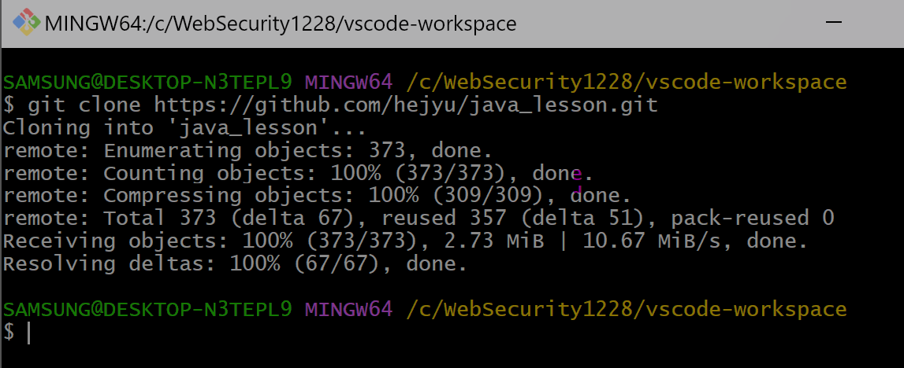
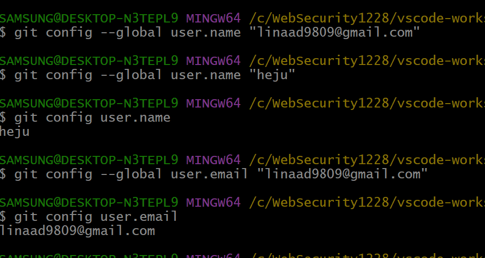

# git clone 뒤 버전 관리 시작 with VSCode

## 1. git clone
- 원격 저장소의 내용을 로컬에 복제하는 Git 명령어
- 원격 저장소의 모든 파일과 커밋 정보를 포함한 모든 정보를 가져온다

### 사용법
1. 작업 디렉터리(작업트리) > shift + 마우스 우클릭 > Open Git Bash Here 선택

1. `git clone {remote repository url}` 입력

- `https://github.com/{user name}/{repository name}.git` : 원격 저장소 url

    

- 로컬에 원격저장소 복제 성공

## 2. 작업 파일의 버전 관리

Git은 파일을 버전을 등록하여 그 버전들 사이의 이동을 자유롭게 하는 `파일의 버전 관리 프로그램`이다

### 버전 관리 사용자의 신원 정보 등록
1. 작업 디렉터리(작업트리) > shift + 마우스 우클릭 > Open Git Bash Here 선택

1. 사용자 이메일과 이름 설정

- `git config --global user.email "linaad9809@gmail.com"`

- `git config --global user.name "heju"`

    