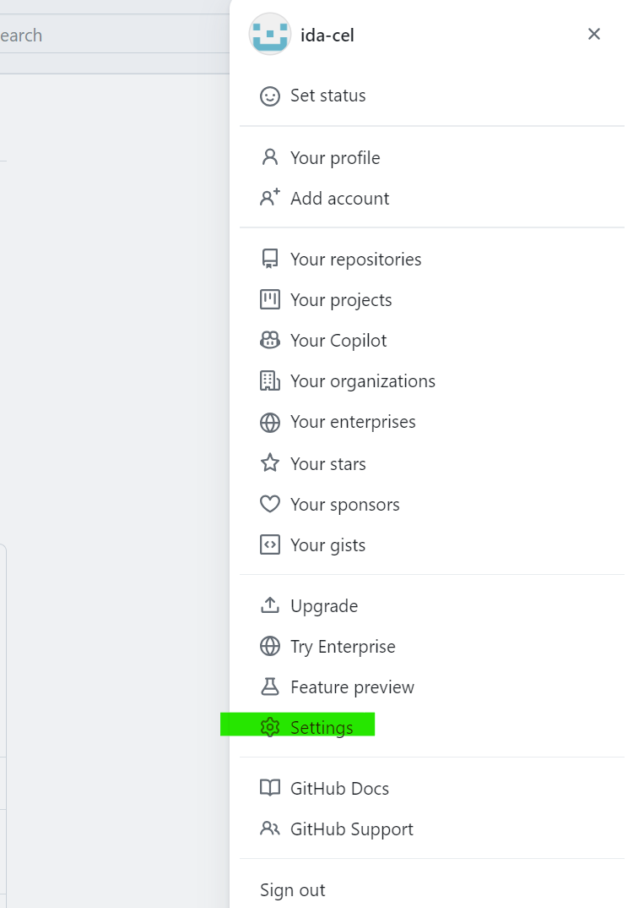
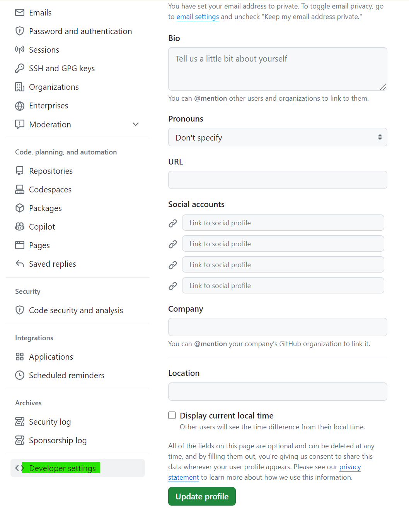
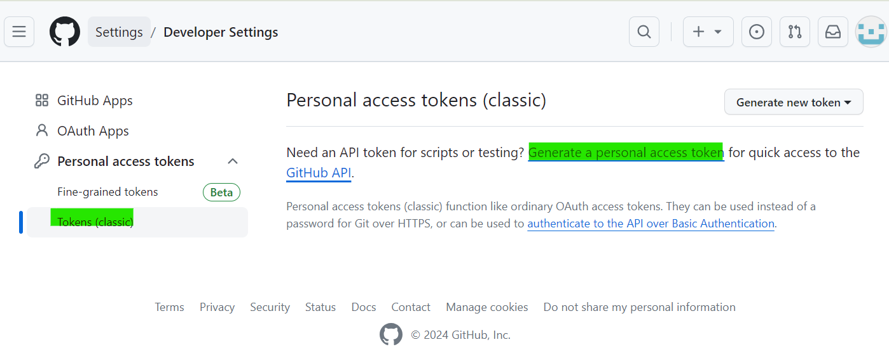
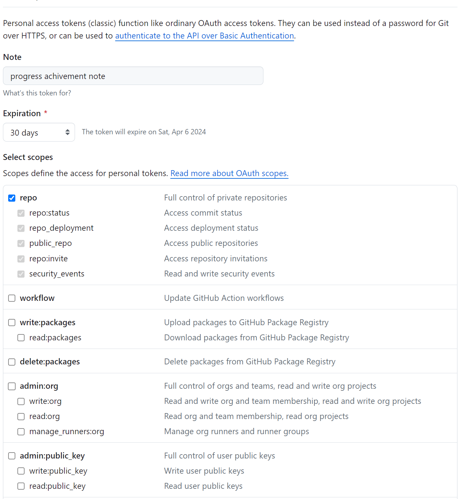
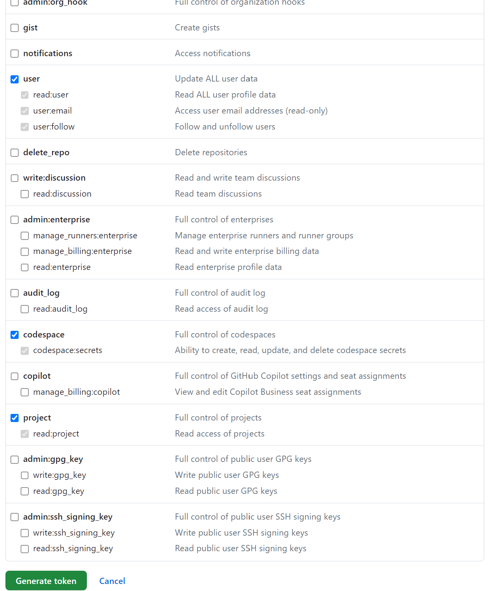

# GitHub에서 토큰 발급받기

GitHub에서 개인 액세스 토큰을 생성하는 방법은 다음과 같습니다

1. GitHub에 로그인합니다.

1. 프로필 이미지를 클릭한 후 Settings를 선택합니다.

    

1. 왼쪽 사이드바에서 Developer settings를 클릭합니다.

    

1. Personal access tokens를 클릭합니다.

1. Tokens (classic) 을 클릭하고 Generate new token 링크로 이동합니다.

    

1. Note 필드에 토큰의 이름을 입력하고, Expiration 필드에 토큰의 만료일을 설정합니다.

1. 토큰에 부여할 스코프(권한)를 선택합니다.
    - GitHub에서 개인 액세스 토큰을 생성할 때 선택할 수 있는 스코프(scope)에 대한 설명은 [Oauth 인증 범위에 대한 설명](https://docs.github.com/ko/apps/oauth-apps/building-oauth-apps/scopes-for-oauth-apps)을 참고하면 좋습니다.

    

    

1. Generate token 버튼을 클릭하여 토큰을 생성합니다.