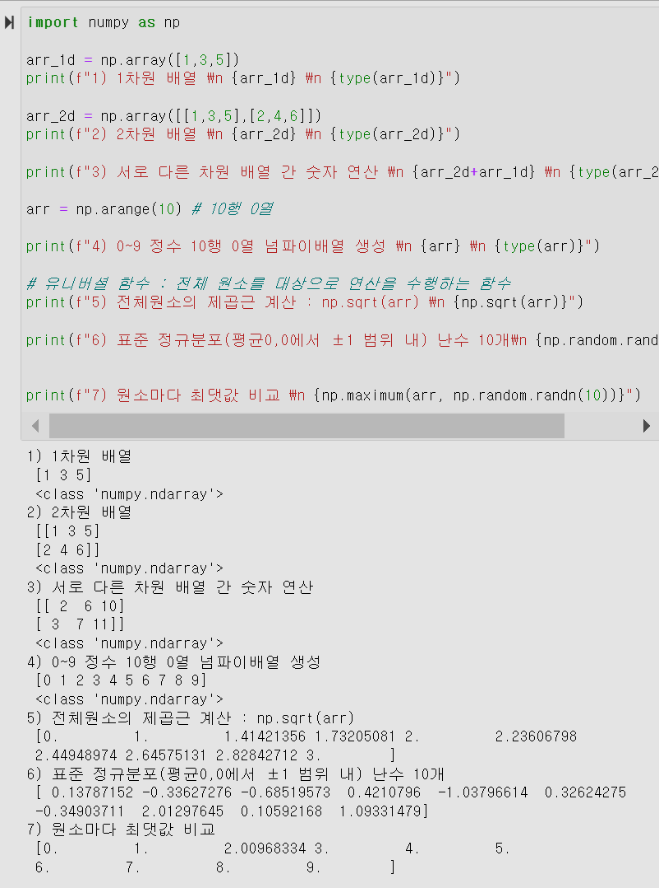

# 파이썬 라이브러리 - Numpy 와 Pandas 

**넘파이 Numpy**

Numeric compuataion 을 수행하는 라이브러리 

특징
1. 다차원 배열 형식 지원

1. 서로 다른 차원 배열간의 연산 지원

1. 넘파이 (ndarray) 배열 안에 있는 전체 원소에 연산을 수행하는 함수 제공

1. 전체 원소 평균이 0이고 평균으로부터 1 범위 내 있는 표준 정규분포 난수를 생성하는 랜덤 함수 제공

1. 숫자(선형 대수) 연산 

    

**판다스 Pandas**

